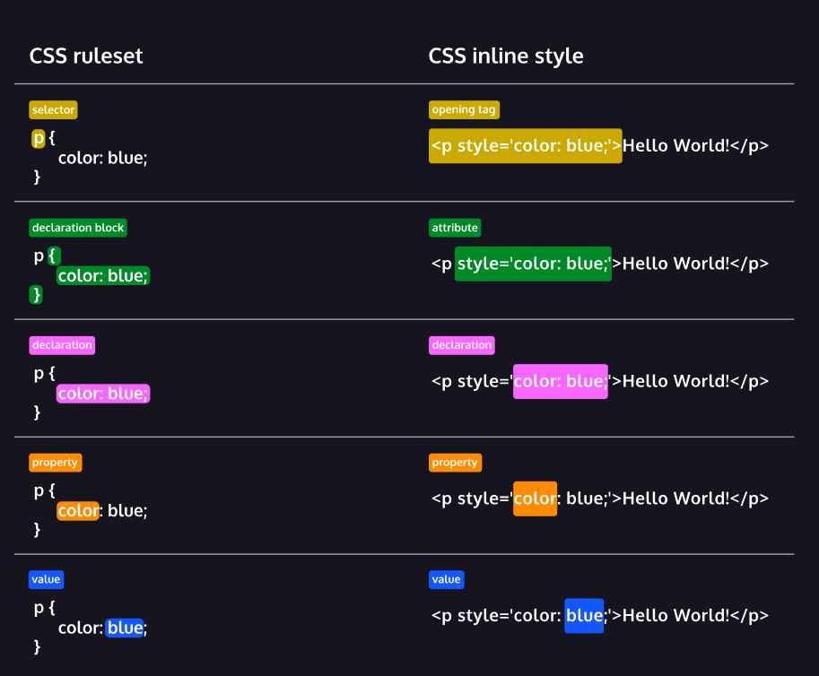

<h1>Cascading style Sheet<h1>
 
<ol>
The basic anatomy of CSS syntax written for both inline styles and stylesheets.
Some commonly used CSS terms, such as ruleset, selector, and declaration.
CSS inline styles can be written inside the opening HTML tag using the style attribute.
Inline styles can be used to style HTML, but it is not the best practice.
An internal stylesheet is written using the <style> element inside the <head> element of an HTML file.
Internal stylesheets can be used to style HTML but are also not best practice.
An external stylesheet separates CSS code from HTML, by using the .css file extension.
External stylesheets are the best approach when it comes to using HTML and CSS.
External stylesheets are linked to HTML using the <link> element.
</ol>
 

