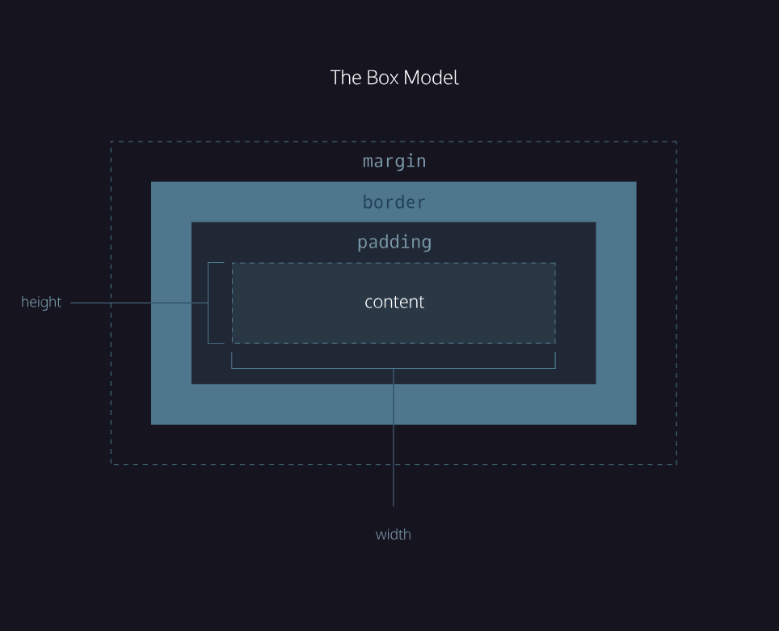
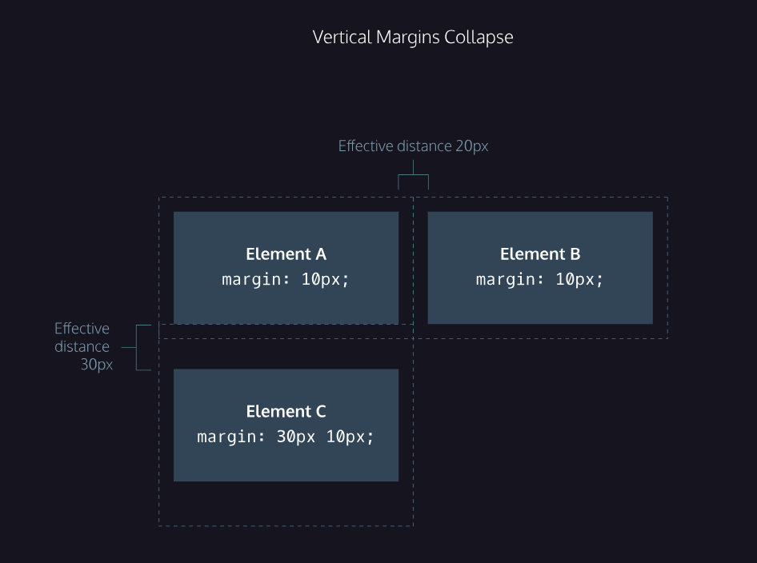

<h1>The Box Model</h1>

The CSS Box Model is a layout system where every HTML element is treated as a rectangular box. 
It consists of content, padding, border, and margin, which together control the size and spacing of elements on a webpage.

All elements on a web page are interpreted by the browser as “living” inside of a box. This is what is meant by the box model. 
For example, when you change the background color of an element, you change the background color of its entire box.
 

 

- width and height: The width and height of the content area.
- padding: The amount of space between the content area and the border
- border: The thickness and style of the border surrounding the content area and padding
- margin: The amount of space between the border and the outside edge of the element.

##Note point of Box model ---

- The box model comprises a set of properties used to create space around and between HTML elements.
- The height and width of a content area can be set in pixels or percentages.
- Borders surround the content area and padding of an element. The color, style, and thickness of a border can be set with CSS properties.
- Padding is the space between the content area and the border. It can be set in pixels or percent.
- Margin is the amount of spacing outside of an element’s border.
- Horizontal margins add, so the total space between the borders of adjacent elements is equal to the sum of the right margin of one element and the left margin of the adjacent element.
- Vertical margins collapse, so the space between vertically adjacent elements is equal to the larger margin.
- margin: 0 auto horizontally centers an element inside of its parent content area, if it has a width.
- The overflow property can be set to display, hidden, or scroll, and dictates how HTML will render content that overflows its parent’s content area.
- The visibility property in CSS determines whether an element is visible or hidden within the page.property can hide or show elements.

<h2>Thank you ❤️</h2>